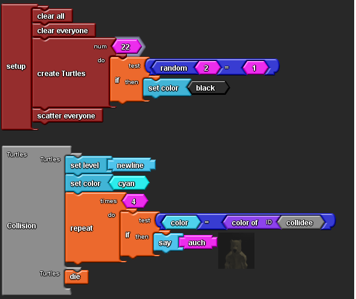

Heute ist unsere erste Informatikstunde und uns wurden die verschiedenen Programme, mit die wir arbeiten können vorgestellt z.B. startlogo TNG , snap, applab und noch viele andere. danach habe ich  Projekte ehemaliger Schüler angeschaut um einen Überblick zu bekommen, wie man mit GitHub und anderen Programmen arbeitet, da ich ein ANfänger war und hatte berhaupt kein vorkenntnisse habe ich geschaut wa, was alles für Afänger mit keinen Vorkenntnisse gut ist und habe mich dann für StartLogo TNG 

DO 27.08.20
Heute habe ich weiter gemacht mit progammieren und habe mit hilfe von Herrn Buhl gelernt wie man ScreenShots machen kann, und habe auch gelernt ,wie ich das verlinken kann.

DI 01.09.2020
Heute habe ich die Lernaktivitäten geschaut und habe versucht das was ich gelernt habe zu mein programm hinzufügen.
